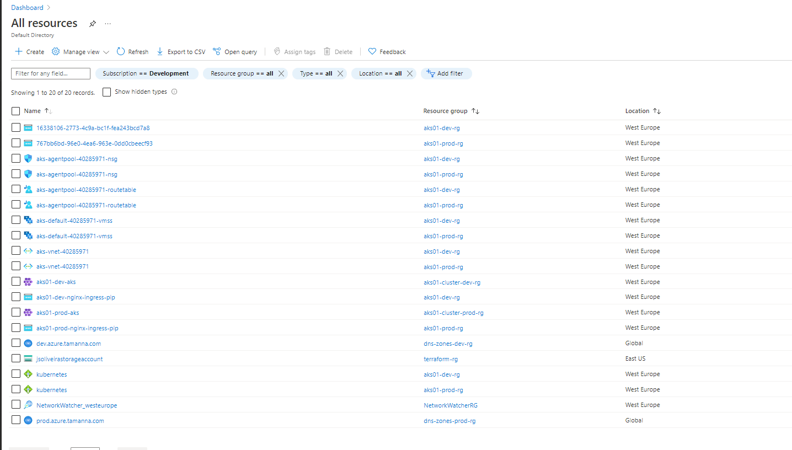

# Cloud engineer challenge

Welcome to the Tamanna's DevOps challenge.
We want to feel your "devops" skiils!

## Calculator application

The calculator application uses a micro service architecture to provide an API to resolve mathematical expressions.

The calculator API exposes a single endpoint, a `POST` method on the `/` root url.
This endpoint receives an expression in the form of JSON:

Expression example:

```
curl -XPOST -H 'Authentication: Bearer binary-example' -H 'Content-Type: application/json' localhost:3000/ -d '{
    "type": "addition",
    "left": 6,
    "right": 1
}'
```

Expressions can be nested:

```
curl -XPOST -H 'Authentication: Bearer nested-example' -H 'Content-Type: application/json' localhost:3000/ -d '{
    "type": "addition",
    "left": {
       "type": "addition",
       "left": 6,
       "right": 1
    },
    "right": {
        "type": "subtraction",
        "left": {
            "type": "addition",
            "left": 6,
            "right": 1
        },
        "right": 1
    }
}'
```

The `calculator` micro service is the gateway where all calculator requests should be done.
The `calculator` service does not solve any expression by it self, it relies on a set of micro services to solve expressions.
There is one micro service per expression, all micro services only expose one endpoint, a `POST` method on the `/` root url and they expect an JSON expression with a numeric `left` and `right` operands.
The `calculator` service is responsible for navigating the expression nodes in such a way that it only calls the expression micro services only with number parameters.

The available mathematical expression micro services are:

-   `addition`:
    Returns a value object with the result of adding both operands.
-   `subtraction`:
    Returns a value object with the result of subtracting the `right` operand from the `left` one.
-   `multiplication`:
    Returns a value object with the result of multiplying both operands.
-   `division`:
    Returns a value object with the result of dividing the `left` by the `right` operand.
-   `remainder`:
    Returns a value object with the result of the remainder of dividing the `left` by the `right` operand.

**Note**:
"kilabs/cloud-engineer-challenge-calculator:latest" image is build from services/base/dockerfile

## Challenge 1. Debug skills

In the root of the project you have a docker-compose that brings all services up.
As you may notice the client service is not working properly and is throwing an error.

We need you to fix it!

### **Answer**:

-   Change Log:
    -   fixed auth property in `client/config.json` 
    -   disabled the expressions [ramainder] and [subtraction] (in `client/config.json`). Those expressions were causing errors due to divisions by zero. The development team must check the client.randomExpression() implementation.

## Challenge 2. Development flow

The team is complaining that confusing to have lots of incomplete work commit to master and it's hard to track what code is in what environment.

Can you come up with a strategy to solve this issue?

### **Answer**:

_I would suggest the following branch strategy based on feature and release branches._

-  **Suggested Branches**:
    -   `master`:  a production snapshop (the source of truth)
    -   `develop`:  a copy of production + new features and bug fixes (it might represent the test environment)
    -   `release/*`: branches for supporting new releases (context isolation)
    -   `feature/*`: branches that will stand for new features or business requirements
    -   `bugfix/*`: branches that will be used for production support (bug fixing)

-  **When a project is starting...**:
    - 1. The team creates a `release` branch from master (`release/xyz`)
    - 2. Later on, the team creates `feature` branch (`feature/xpto`) based on the `release` one created before
    - 3. A business requirement is commited into the `feature` branch (`feature/xpto`).
    - 3. Once the requirement is ready, the `feature` branch (`feature/xpto`) should be merged into the `release` branch (`release/xyz`)
    - 4. The `release` branch (`release/xyz`), now contains a new `feature` and can now be merged to `develop` so the tester can check the `feature` implementation. 
        (merging the `feature` branch into `develop` is also a valid option but, at the end, it should get merged into the `release` branch [for more flexibility on projects concurrency])
    
-   **When a critical bug comes up from production...**
    - 5. The team creates a `bugfix` branch (`bugfix/fix`) based on `master` (copy of production)
    - 6. The bug fix is committed into the new `bugfix` branch and then merged to `develop` so the tester can make sure that the issue is fixed. 
    - 7. Since the tester gives the thumbs up, the `bugfix` branch can be merged to `master` 
        ( merging `develop` into `master` is also a valid option, but the team must be aware of new features in develop [waiting for the release] before the merging ).

```
    [feature/*]    /7-\\------\\-----------------\\
    [release/*]   /7-  \_------\_---\\---\\---\_--\\--\\
    [develop  ]  /7-        /7-------\_---\\-------\_--\\------>
    [master   ]  \-        //   /7---------\_-----------\_--->
    [bugfix/* ]   \_-----.//---//
```

## Challenge 3. Test the application before deployment

At KI, all our code needs to be properly tested. If you take a look to the services, you have a folder called test where we are doing some unit tests using mocha (https://mochajs.org/)

We need you to implement a CI system to test it.

Choose one system, travis-ci, gitlab-ci, circleci... whatever you want and make the necessary change to have a proper Git and CI flow.

### **Answer**:

For CI I've chosen bitbucket pipelines (just for the fun of it).

I've created a [bitbucket-pipeline.yml](bitbucket-pipeline.yml) file in the repository root that will build and push the container images into the my docker hub account. https://hub.docker.com/u/jsoliveira

https://bitbucket.org/jsoliveira/challenge-devops-master/addon/pipelines/home#!/results/5


There are multiple pipelines in the yaml files:
- one that does the CI for dev on code pushing to develop
- one that does the CI for prod on code pushing to master
- one that let the developers chose the branch to deploy (manually)
    - then the deploy gets finished the the deploy will run an automerge to master or develop accoording to the deployment target and will update the image version in the kubernetes workloads repo (or directory in our case).
- FluxCD will know where to deploy the new pushed images (dev or prod) according to the branch and cluster directory. (more details down below)

## Challenge 4. Deploy it to kubernetes

At this point you should have a proper flow going. Now we need to deploy it!

Please create a script with whatever tools you which to deploy the app to a Kubernetes cluster.

## Answer
For this challenge I've created a new directory ([kubernetes](kubernetes/)) in the repository root.

The kubernetes directory is ready to be used as a separate repository and it contains all the K8s workloads needed for deploying the micro services solution.

Inside the [kubernetes](kubernetes/) dir there are different folders reprenting the different AKS clusters.

The Kustomization.yaml files will ensure that each cluster receive the proper workload definitions.

Deploying K8s workloads to dev:

```powershell
kubectl kustomize kubernetes/aks01-dev | kubectl -apply -f -

#or

kubectl kustomize kubernetes/aks01-prod | kubectl -apply -f -
```


Instead of creating helm charts I've pereferd using simple templates using the kustomization tool.

The template can be found under the [kubernetes/services/.template](kubernetes/services/.template) dir.

The kustomziation files will make sure that all services inherit what's needed to get the containers running in a K8s CLuster.

_For CD I've chosen FLuxCD and it will be installed along with the infrastructure.(More details down below.)_


## Challenge 5: Create infrastructure

Now is the part that we will need you to deploy this system to the target infrastructure.

As a good cloud engineer you will do this in an automated and reproducible way, taking advantages of infrastructure as code solutions. We would prefer if you use a cloud agnostic solution target whatever cloud provider you prefer.

(note: since testing this solution may incur some costs, we will ignore errors that might come from not testing/running the script)

## Answer
For accomplishing this challenge I've chosen terraform + azure as cloud provider.

The infrastructure state (terraform state) has been stored in a private azure storage account (because of sensitive data). For this challenge I am assuming that high availability and extra security is not needed. 

The details of the infrastructure and AKS clusters setup can be found at [./infrastructure/main.tf](./infrastructure/main.tf).

### Booting up the infrastructure:

```powershell
# set the working directory
cd infrastructure

#set the access key for terraform remote backend (state)
$env:ARM_ACCESS_KEY="<azure storage account access key>"

# login into azure
az login

# install the terraform providers
terraform init

# boot up the infra
terraform apply -auto-approve
```



### Fetching AKS cluster credentials

```powershell
# Production Cluster
az aks get-credentials --admin --name aks01-prod-aks --resource-group aks01-cluster-prod-rg

# Development Cluster
az aks get-credentials --admin --name aks01-dev-aks --resource-group aks01-cluster-dev-rg

```
### Destroying the infra

```powershell
terraform destroy -auto-approve
```

## Bonus

-   Update your CI to also do CD

## Aswer

For the CD platform I've chosen FLuxCD. https://fluxcd.io/

FluxCD is installed along with the infrastuture (using terraform):
- [./infrastructure/main.tf](./infrastructure/main.tf)
- [./infrastructure/modules/fluxcd](./infrastructure/modules/fluxcd)

During the installation a remote repository containing all the K8s workloads is configured.

The FluxCD will be continuously looking for changes in the remote repository. When new commits arrive the differences are applyied to the existing AKS clusters thru the "kustomization" of the [aks01-dev](kubernetes/aks01-dev) and [aks01-prod](kubernetes/aks01-prod) directories.

When a container is built by the bitbucket-pipelines.yml the version of the containers built are commited to to the kubernetes [repository](kubernetes/), then the FluxCD will sync the repository with the K8s cluster. 

I could use the FluxCD controllers for image-automation, but I'd prefer to keep it simpler.